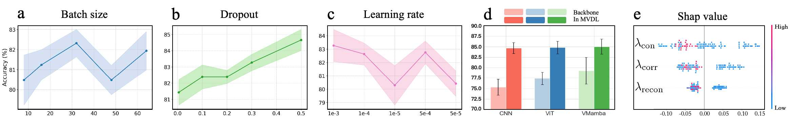
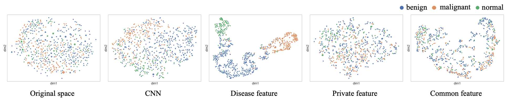

# DISENTANGLED REPRESENTATION LEARNING WITH CROSS FACTOR CONSTRAINTS FOR MEDICAL IMAGE ANALYSIS
Created by <u>Xie Huang</u>, <u>Linlu Xu</u>,<u>Yipin Zhang</u>,<u>Ziqi Yu</u>,<u>Shengjie Zhang</u>

A PyTorch framework for disentangled medical image representation learning, designed to separate disease-related, common, and subject-specific features with cross-factor constraints.
## Cross-Factor Disentanglement Module
In the proposed framework, disease-related representations are not treated as isolated factors, but are intentionally coupled with subject-private variations. While population-shared features are constrained to remain independent, disease representations are aligned with their disease–private counterparts to preserve subject-specific characteristics. This design is motivated by a clinical observation: disease patterns are shared at the pathological level, yet their visual manifestations vary across individuals due to anatomical and physiological differences. Accordingly, the disease representation can be interpreted as a combination of shared pathological components and individual-specific expression, a perspective that is often overlooked in existing disentanglement frameworks.
```python
class FeatureFusionSystem(nn.Module):
    def __init__(self, embed_dim=32):
        super().__init__()
        self.mlp1 = MLP1(embed_dim)
        self.mlp2 = MLP2(embed_dim)
        self.mlp3 = MLP3(embed_dim)
        
        self.fusion = nn.Sequential(
            nn.Linear(embed_dim * 3, 256),
            nn.LayerNorm(256),
            nn.ReLU(),
            nn.Linear(256, 32 * 32)
        )
    
    def forward(self, x1, x2, x3):
        feat1 = self.mlp1(x1)  
        feat2 = self.mlp2(x2)  
        feat3 = self.mlp3(x3)  
        
        fused = torch.cat([feat1, feat2, feat3], dim=-1)  
        return self.fusion(fused).view(-1,1, 32, 32)
```

## Usage

### Requirements
- Python>=3.12.2
- torch>=2.7.1
- torchvision>=0.22.1


**Data preparation**: 

The project is organized under a single workspace directory. The BUSI dataset
and all training scripts are placed together for convenience.
```text
data/
└── vscode/
    ├── Dataset_BUSI_with_GT/
    │   ├── benign/
    │   │   ├── benign (1).png
    │   │   ├── benign (1)_mask.png
    │   │   ├── benign (2).png
    │   │   ├── benign (2)_mask.png
    │   │   ├── ...
    │   ├── malignant/
    │   │   ├── malignant (1).png
    │   │   ├── malignant (1)_mask.png
    │   │   ├── malignant (2).png
    │   │   ├── malignant (2)_mask.png
    │   │   ├── ...
    │   ├── normal/
    │   │   ├── normal (1).png
    │   │   ├── normal (1)_mask.png
    │   │   ├── normal (2).png
    │   │   ├── normal (2)_mask.png
    │   │   ├── ...
    │
    ├── data_loader.py        # BUSI dataset loading and preprocessing
    ├── model.py              # Network architecture definition
    ├── train.py              # Training loop and loss computation
    ├── visualize.py          # Visualization utilities
    ├── main.py               # Training entry point
```

### Evaluation

To evaluate a trained model on the BUSI test set, run:

```
python main.py \ --resume /path/to/final_model.pth \ --output_dir ./results
```


### Training

#### BUSI Dataset

To train the model on the Breast Ultrasound Images (BUSI) dataset from scratch, run:

```
python main.py \ --learning_rate 5e-4 \ --batch_size 32 \ --num_epochs 300 \ --lambda_recon 0.05 \ --lambda_corr 0.005 \ --lambda_contrast 0.005 \ --output_dir ./results
```


## Visualization

We provide several visualization utilities to inspect the training process
and the behavior of the model on the BUSI dataset.

### Training Curves

The training loss and test accuracy are recorded and plotted over epochs to
monitor convergence during optimization.

```python
plot_training_results(train_loss, test_acc, save_path) 

```
## Figure Generation


These figures are generated by systematically varying key training hyperparameters and model components, and reporting the corresponding performance statistics across multiple runs.  
All results are visualized using line plots, bar charts, and SHAP-based analyses to reflect performance trends, model comparison, and loss contribution.



These plots are generated by applying t-SNE to feature embeddings extracted from the CNN backbone and the disentangled disease, private, and common branches of the model.

## License
MIT License

## Citation
If you find our work useful in your research, please consider citing:

```python


```
